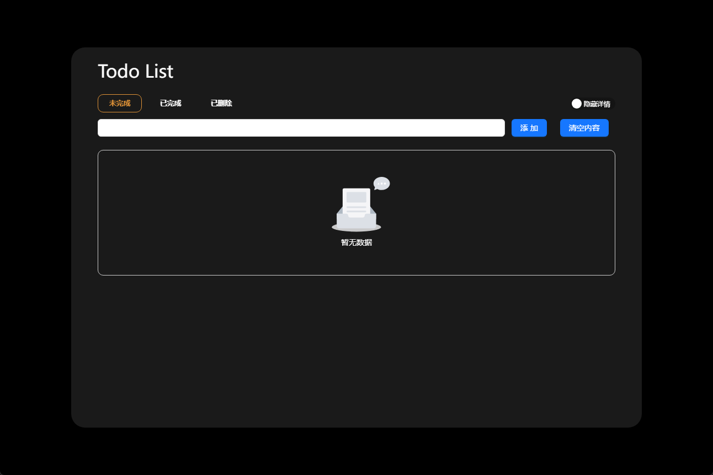
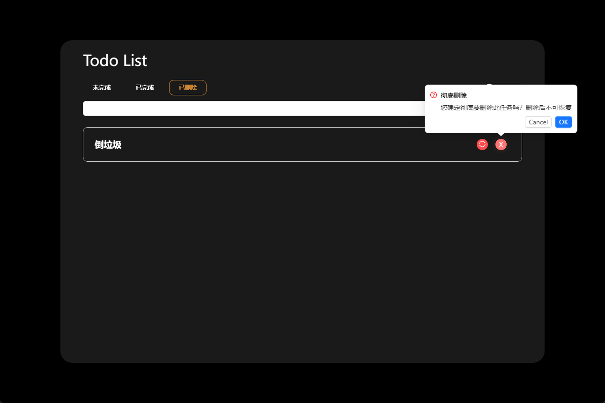

# todo_list

  

TODO列表，React练习项目
[在线地址](http://119.91.211.99/todo/)

## 功能清单
- [x] 待办事项查看，分三种状态`未完成`、`已完成`、`已删除`
- [x] 添加事项
- [x] 移除事项（伪删除）；彻底删除事项；
- [x] 修改未完成的事项内容,可修改描述内容和标题
- [x] 切换按钮:用于显示详情的switch按钮
- [x] 状态更新按钮:点击后,3秒,状态由[未完成]转换为[已完成]
- [x] 轮询自动保存数据到localStorage
- [ ] 支持数据导出
- [ ] 支持数据导入

## 界面预览
### 列表

### 彻底删除任务

### 恢复任务

